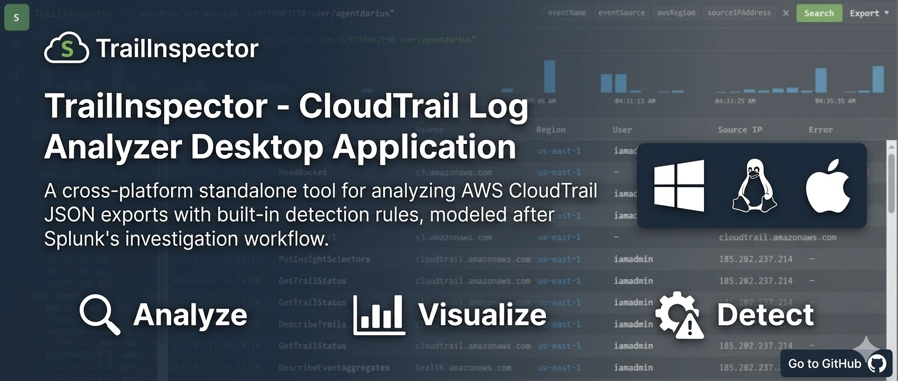
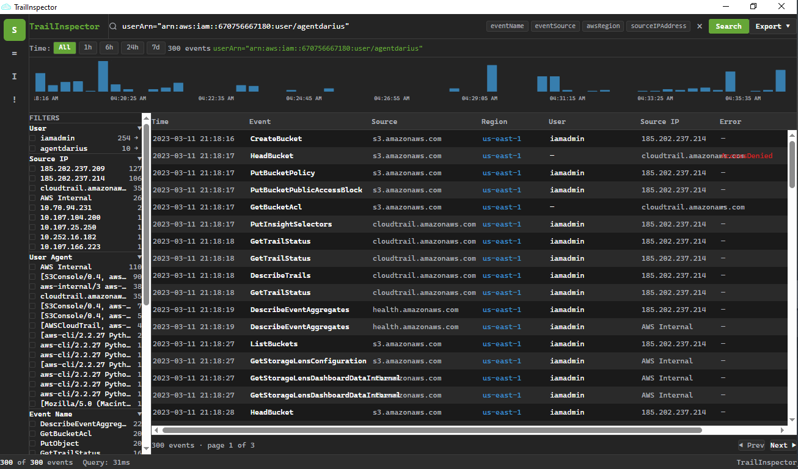
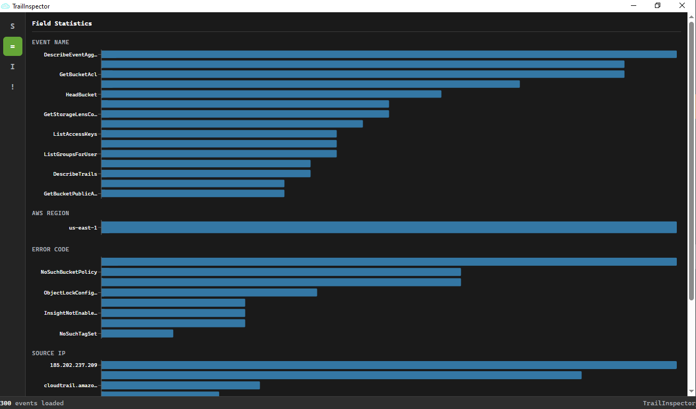
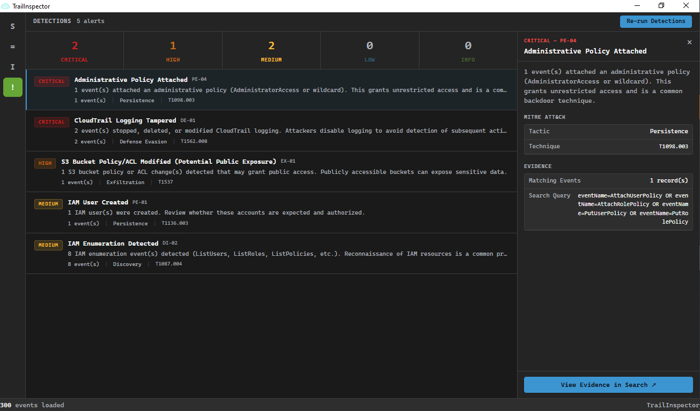
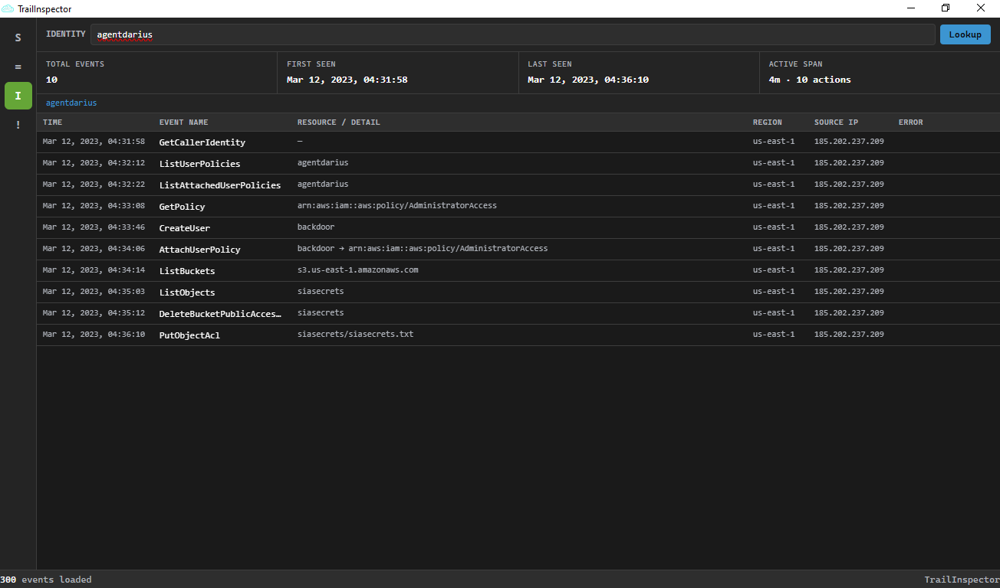
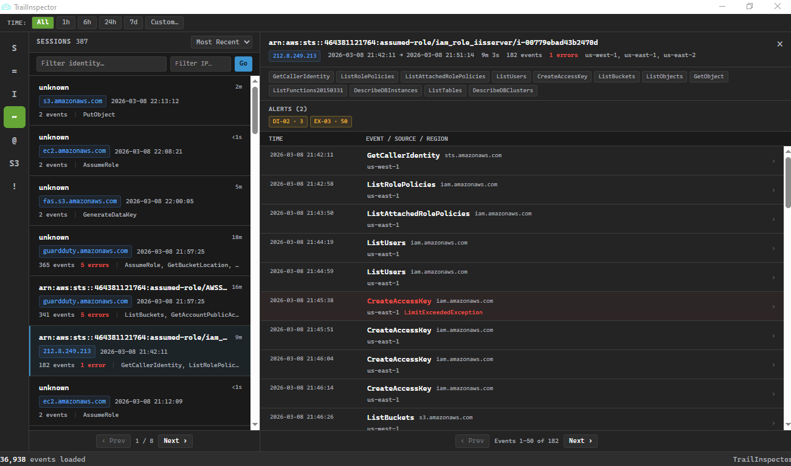
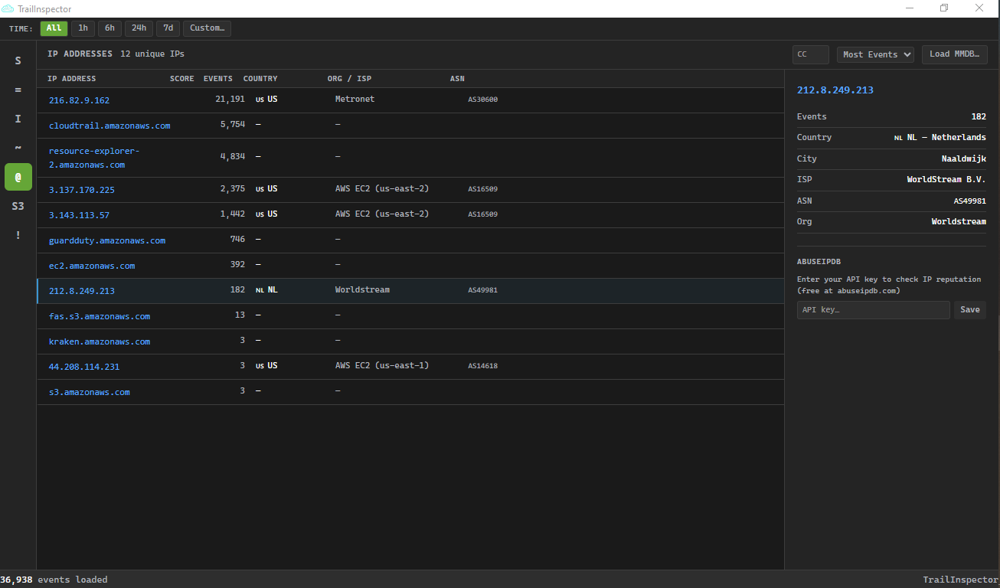
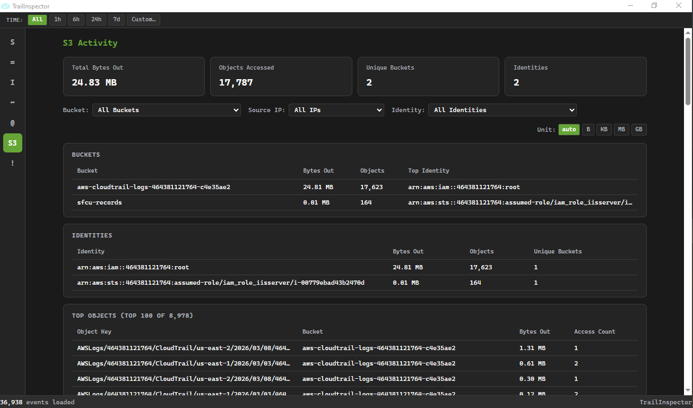

<p align="center">
  
</p>

<h1 align="center">TrailInspector</h1>

<p align="center">
  A fast, offline desktop tool for investigating AWS CloudTrail logs — built for blue teamers, incident responders, and cloud security engineers.
</p>

<p align="center">
  <a href="https://github.com/ChickenLoner/TrailInspector/releases"></a>
  <a href="https://github.com/ChickenLoner/TrailInspector/actions"></a>
  
  
</p>

---

## Overview

TrailInspector loads raw CloudTrail exports — `.json`, `.json.gz`, or ZIP archives — entirely in memory and lets you search, visualize, triage threats, and investigate sessions without sending data to any external service. It can also pull logs straight from a live AWS account, so you never have to leave the tool to run the CLI.

The investigation workflow is modeled after Splunk: a query bar with SPL-like syntax, a timeline histogram for scoping time windows, field statistics for pivoting on values, a detections panel that fires **60 MITRE ATT&CK-mapped rules** automatically plus any **custom YAML rules** you define, session grouping to cluster activity by identity and IP, and offline IP enrichment via DB-IP Lite.

## Screenshots

### Search & Event Table
Filter events with SPL-like queries (`AND`, `OR`, `NOT`, wildcards). Results stream into a paginated table with inline time scoping via the timeline histogram.



### Field Statistics
One click reveals value distributions for every field in the current result set — event names, regions, source IPs, error codes.



### Detections — MITRE ATT&CK Mapped Rules
60 built-in detection rules fire automatically. Each alert shows severity, tactic/technique, a plain-English description, and the exact search query used — click **View Evidence** to jump straight to matching events.



### Identity Timeline
Pivot to any IAM identity and see every action it took in chronological order — first seen, last seen, active span, and a full event list.



### Sessions
Activity automatically clustered into sessions by `(identity, source IP)` with a 30-minute inactivity gap. Each session shows duration, event count, errors, regions, and correlated alerts.



### IP Enrichment
All source IPs enriched with country, city, ASN, and organisation via DB-IP Lite (offline MMDB) or automatic online lookup. Optional AbuseIPDB reputation check.



### S3 Activity
Dedicated investigation surface for S3 data exfiltration analysis — total bytes transferred out, top objects by bytes, per-bucket and per-identity breakdowns. Filter by bucket, source IP, or identity. Byte unit toggle (auto / B / KB / MB / GB). Respects the global time bar.



---

## Features

| Capability | Details |
|---|---|
| **Ingest** | `.json`, `.json.gz`, `.zip`, and nested directory trees; folder or single-file import; `aws cloudtrail lookup-events` exports read natively; parallel decompression via Rayon |
| **Live Import** | Pull logs from a live AWS account via `LookupEvents` or the trail's S3 bucket — no AWS CLI required |
| **Search** | SPL-like query bar — `AND` / `OR` / `NOT`, field matching, wildcards, time presets |
| **Visualize** | Timeline histogram, field statistics, identity activity timeline |
| **Detect** | 60 built-in MITRE ATT&CK-mapped rules + custom YAML rules with AND/OR/NOT filters and sliding-window thresholds |
| **Sessions** | Automatic activity session grouping by `(identity, IP)` with 30-min inactivity gap |
| **IP Enrichment** | Offline GeoIP lookup (DB-IP Lite, free, no registration) — country, city, ASN; geo anomaly rules |
| **S3 Analysis** | Bytes transferred out, top objects, per-bucket/identity breakdown; bucket, IP, and identity filters |
| **Investigate** | One-click "View Evidence" jumps from alert → filtered event table |
| **Correlate** | Session ↔ alert cross-linking; AssumeRole chain detection across accounts |
| **Export** | Save filtered results as CSV or JSON |
| **Offline by default** | No telemetry. All parsing, indexing, and analysis happen locally — the only outbound traffic is what you explicitly trigger (live import, online IP lookup, AbuseIPDB) |

---

## Installation

Download the latest installer for your platform from the [Releases](https://github.com/ChickenLoner/TrailInspector/releases) page:

| Platform | Format |
|---|---|
| Windows | `.exe` (NSIS installer) |
| Linux | `.AppImage` / `.deb` |
| macOS | `.dmg` |

---

## Build from Source

### Prerequisites

- [Rust](https://rustup.rs/) (stable toolchain)
- [Node.js](https://nodejs.org/) 18+
- [Tauri v2 prerequisites](https://tauri.app/start/prerequisites/) for your platform

### Development

```bash
# Install frontend dependencies
cd ui && npm install

# Start frontend dev server (port 5500)
npm run dev

# In a second terminal — launch the full Tauri app
cargo tauri dev
```

### Run Tests

```bash
cargo test -p trail-inspector-core              # default: offline, no AWS SDK
cargo test -p trail-inspector-core --features aws   # includes the live-import module
```

The AWS SDK sits behind the `aws` cargo feature so the default `crates/core` build stays synchronous, offline, and quick to test. The desktop app enables it unconditionally.

### Production Build

```bash
cargo tauri build
```

Installers are written to `crates/app/target/release/bundle/`.

---

## Importing from Live AWS

Click **Import from Live AWS** on the start screen to pull logs without touching a terminal.

### Credentials

Two ways in, whichever suits you:

- **Enter keys directly** — access key, secret key, and (for temporary `ASIA…` keys) a session token. No AWS CLI installation or configuration needed.
- **Named profile** — pick any profile already in `~/.aws/config` or `~/.aws/credentials`.

Typed keys are held **in memory for the session only**. They are never written to disk, never stored in browser storage, and never written to `~/.aws` — your existing CLI setup is left untouched. **Clear cache** wipes them immediately, along with any downloaded files. Only your region, endpoint, and profile *name* are remembered between launches.

### Sources

| Source | Needs | Covers |
|---|---|---|
| **LookupEvents API** | `cloudtrail:LookupEvents` | Last 90 days. No S3 access required — often the only permission an audit role has |
| **S3 trail bucket** | `s3:ListBucket`, `s3:GetObject`, and `cloudtrail:DescribeTrails` *(unless you name the bucket)* | Full trail history, full fidelity |

Naming the bucket explicitly skips `DescribeTrails` entirely — useful when your role can read the bucket but can't enumerate trails.

### Check before you pull

**Check** downloads and counts everything first, then reports the exact event count, time range, and any trails or buckets found. Nothing replaces your loaded dataset until you press **Pull** — and Pull reuses what Check already downloaded, so you don't pay for the transfer twice.

Leave both time fields empty to take everything available. `LookupEvents` is rate limited to roughly 2 requests/second, so a wide window genuinely takes a while.

### Emulated AWS (LocalStack, moto, CTF ranges)

Set **AWS URL** to your endpoint (the `aws --endpoint-url` equivalent). S3 automatically switches to path-style addressing, and the CloudTrail target header is sent in the fully-qualified form the AWS CLI uses, which some emulators require.

---

## GeoIP Setup (Optional)

To enable IP enrichment and geo anomaly rules, download the free **DB-IP Lite** databases from [db-ip.com/db/lite.php](https://db-ip.com/db/lite.php) (no registration required, CC BY 4.0) and load them via the IP tab:

- [`dbip-city-lite.mmdb`](https://db-ip.com/db/download/ip-to-city-lite) — country, city, and coordinates
- [`dbip-asn-lite.mmdb`](https://db-ip.com/db/download/ip-to-asn-lite) — ASN and organisation

Without the databases the tool still works fully — IP enrichment and geo anomaly rules (`GEO-01`, `GEO-02`) are simply disabled.

---

## Architecture

```
TrailInspector/
├── crates/
│   ├── core/          # Pure Rust library — parse, index, query, detect, session, geoip, fetch (no Tauri)
│   └── app/           # Tauri v2 IPC glue — thin command wrappers only
└── ui/                # React + TypeScript + Vite + TailwindCSS frontend
```

`crates/core` has zero Tauri dependency and is fully testable as a standalone library. All business logic — ingestion, indexing, the query engine, detection rules, session grouping, and IP enrichment — lives there.

---

## Detection Rules

TrailInspector ships **60 built-in detection rules** across 13 service categories. See [RULES.md](RULES.md) for the complete rule catalogue with trigger events and MITRE technique mappings.

You can also write **custom YAML rules** that fire alongside the built-ins — no Rust required. Rules support recursive AND/OR/NOT filter trees, multi-event matching, and sliding-window thresholds. Edit `rules.yaml` in your app config directory and click **Reload Rules** in the Detection tab.

**Quick summary by category:**

| Category | Rules | Max Severity |
|---|---|---|
| Initial Access | 3 | Critical |
| Persistence | 7 | Critical |
| Defense Evasion | 13 | Critical |
| Credential Access | 4 | Critical |
| Discovery | 2 | Medium |
| Exfiltration | 5 | High |
| Impact | 3 | Critical |
| Network / VPC | 8 | High |
| RDS | 3 | High |
| EBS | 5 | Critical |
| Lambda | 2 | High |
| Resource Sharing | 3 | High |
| Geo Anomaly | 2 | High |

---

## License

MIT © [ChickenLoner](https://github.com/ChickenLoner)
